# Read & Review API

This is the Read & reviews API build with Django REST Framework. The read & review API contains CRUD functionality(Create, Read, Update, Delete). User must sign in to access all the features available on the platform such as Post and comment on reviews made. The read & review API is made for sharing content(Posts, Comments) and make interactions possible for users who enjoy reading books.

## Validation

- CI python Linter
- tested in all serializers and views.

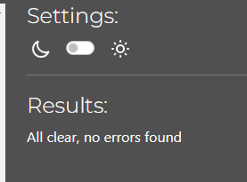

## Diagram for models

Diagram models comment 

 
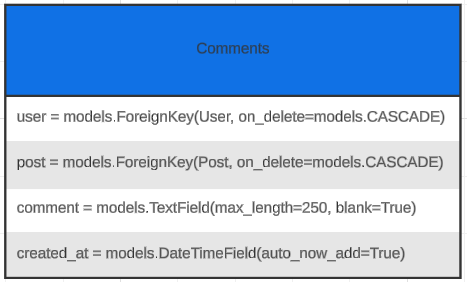

Diagram models post 

 
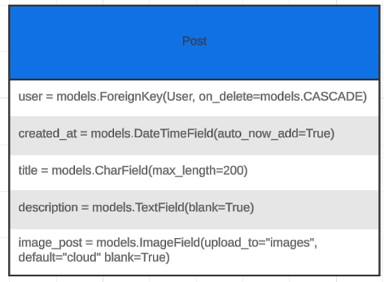

- lucid.app to create the diagrams

# Planning

### User stories om github

- Here is all the user storys made for this project. from the django rest back-end to React front-end planning.

[User story github](https://github.com/users/Timalexanderandersson/projects/11)

# Agile methodology

Was using Agile methodology while working on the project Read & Review. which worked good, following the user storys and checking them of one by one. making sure they was living up to acceptance criteria.

# Testing in Django REST

## Testing in Django REST

### views

| Status  | **Posting - Post is valid**                            |
| :-----: | :----------------------------------------------------- |
| &check; | test for sending post (status code 201). created post. |

| Status  | **Comments - Valid comment created**                           |
| :-----: | :------------------------------------------------------------- |
| &check; | tested for creating comment (status code 201) comment created. |

| Status  | **sign in - Valid Data**                                     |
| :-----: | :----------------------------------------------------------- |
| &check; | When the user try to sign in (status code 200) user sign in. |

## Deployment

### Create project repository github

Log in to **GitHub** then navigate to **Code institute template** for making the project. 

[Code institute template ](https://github.com/Code-Institute-Org/ci-full-template).

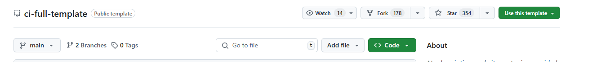

Click on the **"Use this template"** on rigth side of the page, and then press the **"Create a new repository"**

Creating a descriptive project name in the **"Repository name"** field. In the Public/Private section choose Public.
Then click **"Create Repository"**.

### Create heroku app

Login to the **heroku platform**.

Navigate to the dropdown bar to the right of the website(New) on the homepage, choose to **"Create new app"**

 <strong>New</strong>

 

 <strong>Create app</strong>

 

Give the app a project name, and choose the location you are in(Eu/US).

 <strong>Us/Eu</strong>

 
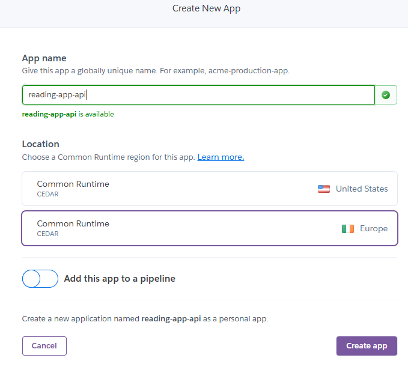

Then press **"Create app"**

### Creating cloudinary account for images

  - **cloudinary** Create account on the https://cloudinary.com/users/register_free website.

  - When access to website. go into **settings** in the left corner of the website on the bottom.

  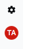

  - Press the section **API Keys** up in the left corner. and press the button for **Generate new API key**

  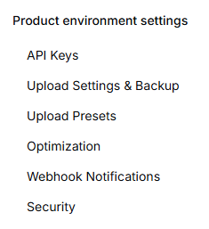

  

  - **API environment variable** copy and paste it in the env.py file.

  - Copy the **API key** and the **API secret** and put them into the env.py inside the **API environment variable** CLOUDINARY_URL=cloudinary://<your_api_key>:<your_api_secret>@dwxzdd3bf
  - And put this in the **Config vars** section in heroku. is found **Settings** and scroll down to **Reveal Config vars**

  Add the CLOUDINARY_URL=cloudinary://<your_api_key>:<your_api_secret>@dwxzdd3bf in this section.

### Creating env.py file

**Preview of one in the list**

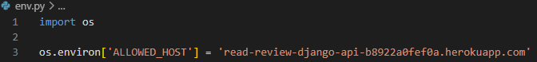

Create env.py for keeping some sensitive information hidden.

- **Make sure its in the .gitignore file**

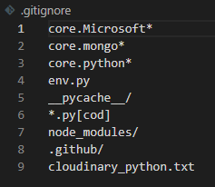

- env.py

The domains or hosts Django API is allowed to run **ALLOWED_HOST**

- ALLOWED_HOST = 'backendherokuapp.com'

  Domain where frontend application is hosted **CLIENT_ORIGIN**

- CLIENT_ORIGIN = "frontend.herokuapp.com"

  The domain used during local frontend development. **CLIENT_ORIGIN_DEV**

  in settings to CORS_ALLOWED_ORIGIN_REGEXES =  r"^https://.*\.codeinstitute-ide\.net$" to access from the react app.

- CLIENT_ORIGIN_DEV = 'IDE-workspace-here-codeinstitute-ide.net'

  API URL for Cloudinary, used for image uploads. **CLOUDINARY_URL**

- CLOUDINARY_URL = 'API-for-CLOUDINARY-key-here'

  The URL to your PostgreSQL database. **DATABASE_URL**

- DATABASE_URL = "database-secret-code-here"

  Django Secret Key for securing your app.**SECRET_KEY**

- SECRET_KEY = "django-secret-key-here"

  Dev for development. IF on DEBUG = True, if development off DEBUG = False **DEV**

- DEV = "for debug on/off"

### creating config vars in heroku

 <strong>Navigate to settings to config vars</strong>

 

 <strong>Config vars here</strong>

 

**Same things as the env.py file here.**
DISABLE_COLLECTSTATIC = 1

ALLOWED_HOST = 'backendherokuapp.com'

CLIENT_ORIGIN = "frontend.herokuapp.com"

CLIENT_ORIGIN_DEV = 'IDE-workspace-here-codeinstitute-ide.net'

CLOUDINARY_URL = 'API-for-CLOUDINARY-key-here'

DATABASE_URL = "database-secret-code-here"

SECRET_KEY = "django-secret-key-here"

DEV = "for debug on/off"

### deploy heroku application

Install **gunicorn** in the command in the terminal

Update the requirements.txt (pip freeze > requirements.txt)

Create a **Procfile file** with the content (release: python manage.py makemigrations && python manage.py migrate

web: gunicorn read_api.wsgi)

 <strong>Procfile</strong>

 
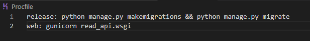

In settings put in the '.herokuapp.com'/ the app to **ALLOWED_HOSTS**.

in heroku aswell.

 <strong>Putting in '.herokuapp.com'</strong>

 

 <strong>Config vars here</strong>

 

Navigate to **"Deploy"** section between the **"Resources"** and **"Metrics"**.

 <strong>Navigate to Deploy and adding github repository</strong>

 
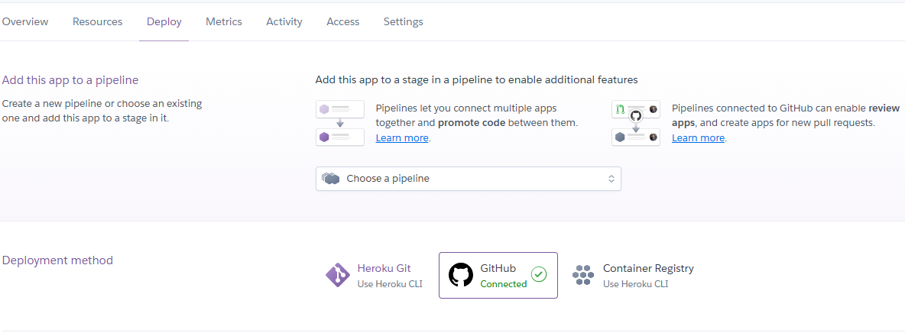

Go to **Deployment method** and choose the **Github** and connect to your Repository project.

Go down to **"Manual deploy"** section and press the **"Deploy Branch"**.

 <strong>Deploy Branch</strong>

 
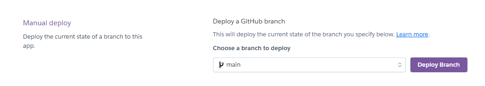

### Problems with deployment on heroku.
Hade some problem with deploying the application since it was wrong in the config vars
with the **DATABASE_URL** and **CLIENT_ORIGIN** ,**CLOUDINARY_URL**.
switch the keys out and it worked.
and problems with keeping the user logged in.
# Installed Libraries

asgiref==3.8.1

bcrypt==4.2.0

cloudinary==1.34.0

dj-database-url==0.5.0

dj-rest-auth==2.1.9

Django==4.2

django-allauth==0.50.0

django-cloudinary-storage==0.3.0

django-cors-headers==4.6.0

django-filter==24.3

djangorestframework==3.15.2

djangorestframework-simplejwt==5.3.1

gunicorn==23.0.0

oauthlib==3.2.2

pillow==11.0.0

psycopg2==2.9.10

PyJWT==2.10.0

python3-openid==3.2.0

pytz==2021.1

requests-oauthlib==2.0.0

sqlparse==0.5.2

urllib3==1.26.20

# Technical Stack

- Django REST: framework for creating API
- Python: back-end for django rest api.
- Gitpod: development
- Git: version control
- PostgreSQL: Database
- Lucidchart: models Diagram.
- Heroku: for deploying back-end.

## Credits

### Help from websites.

- https://www.django-rest-framework.org/ 
- Code institute project for Django REST framework.
- lucid.app for making my models.
